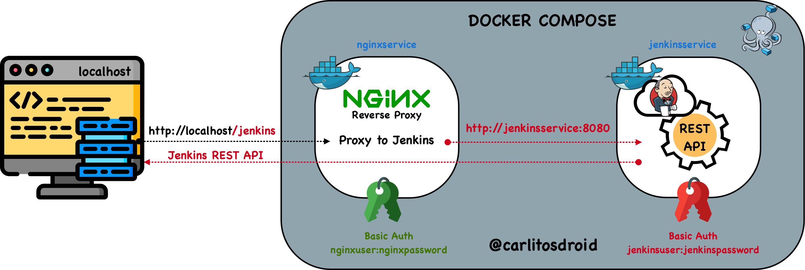
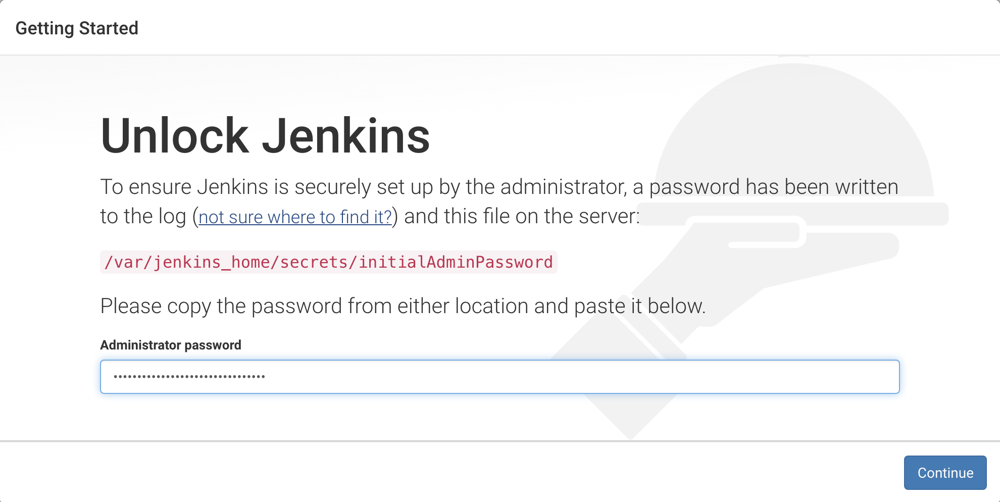
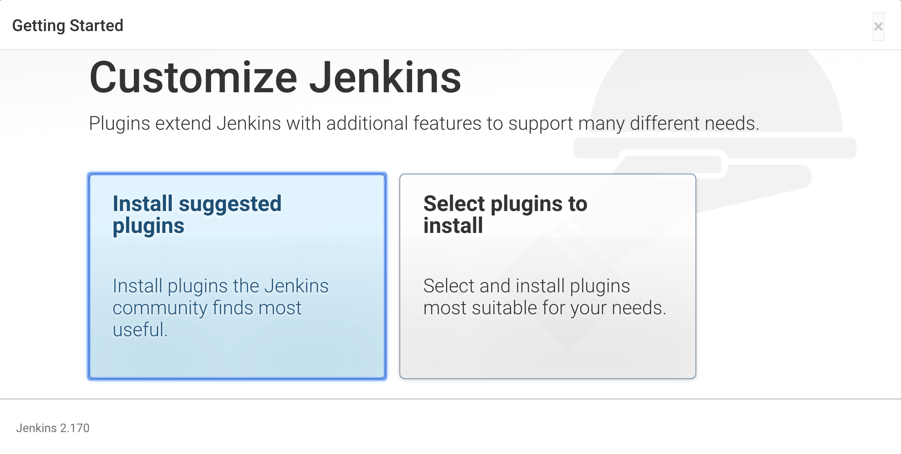
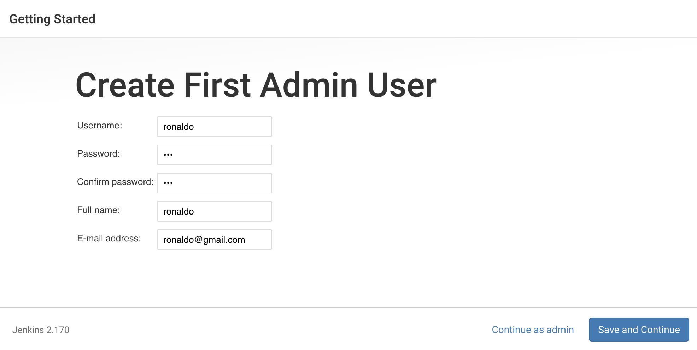
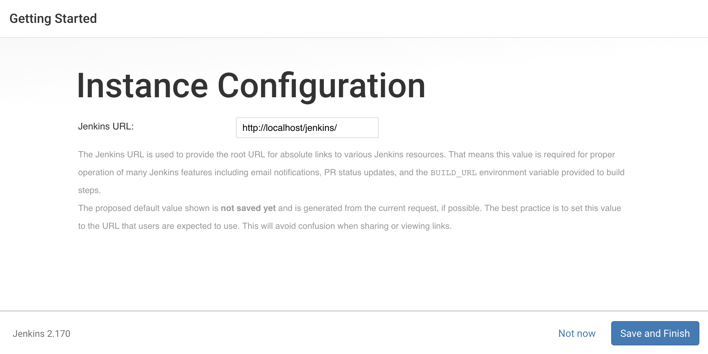

<h1 align="center">JENKINS BEHIND NGINX WITH DOCKER</h1>
<h2 align="center">POWERED BY CARLITOSDROID</h2>

<p align="center">
    
</p>

## MEDIUM POST
Take a Look at the complete Post at medium about [how to use Jenkins REST API behind NGINX reverse proxy][1].

## SUMMARY
This Docker Project uses the latest versions of [nginx][1] and [jenkins][2] docker official images. You will be able to use nginx as a reverse proxy server to access jenkins automation server. This project is well-recommended for development purpose.

## LET'S GET STARTED
## 1. Install `Docker` and `Docker Compose` on your machine.
## 2. At top level project run `docker-compose up` command from terminal.
## 3. Verify NGINX and Jenkins containers are in up state.
```bash
docker ps
```
You will see two running containers as follows
## 4. Access to the running NGINX container.
```bash
docker exec -i -t <your_nginx_container_id> bash
```
## 5. Inside the NGINX docker container, we must create your own user basic auth.
```bash
htpasswd /etc/apache2/.htpasswd 'YOUR_USER_NAME'
```
* Write your username and hit enter button, then you have to write your password twice.
## 6. Go to http://localhost/jenkins and you'll be prompted to write username and pasword.

## 7. That's all, you have a NGINX basic auth now.

## 8. Write your jenkins key
<p align="center">
    
</p>

## 9. Install suggested plugins
<p align="center">
    
</p>

## 9. Your Admin User(credentials that will be place in /etc/nginx/conf.d/default.conf in NGINX Authentication Header)
<p align="center">
    
</p>

## 9. Your Jenkins URL
<p align="center">
    
</p>

## 10. Happy coding!!

[1]: https://medium.com/p/16a970664fc1/edit